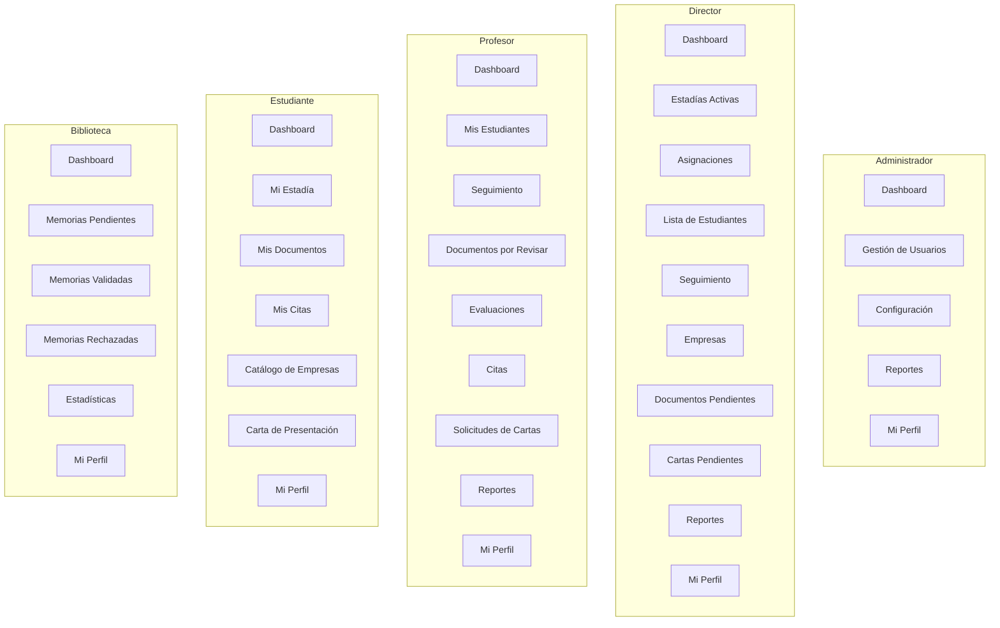
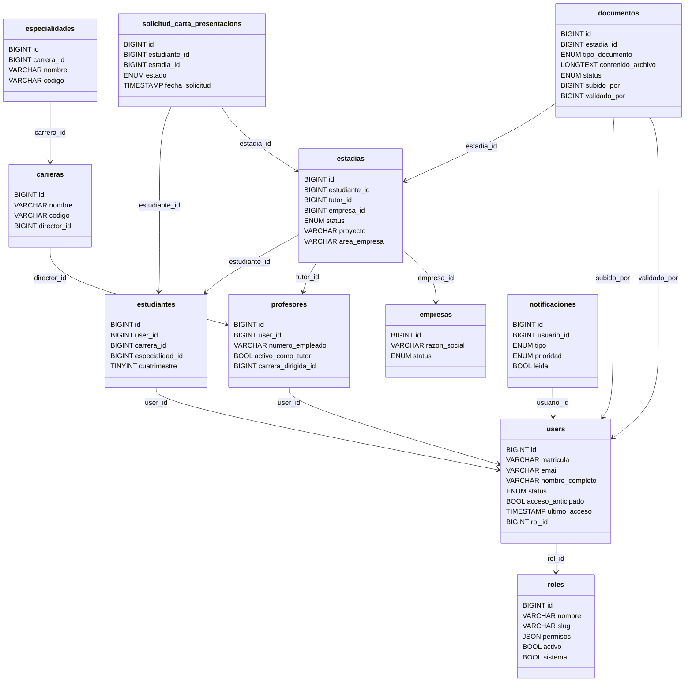
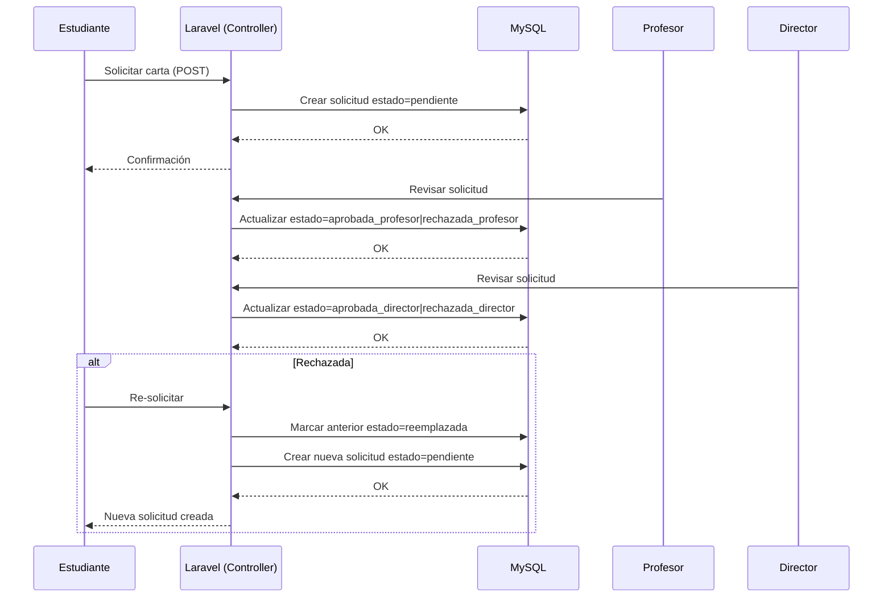
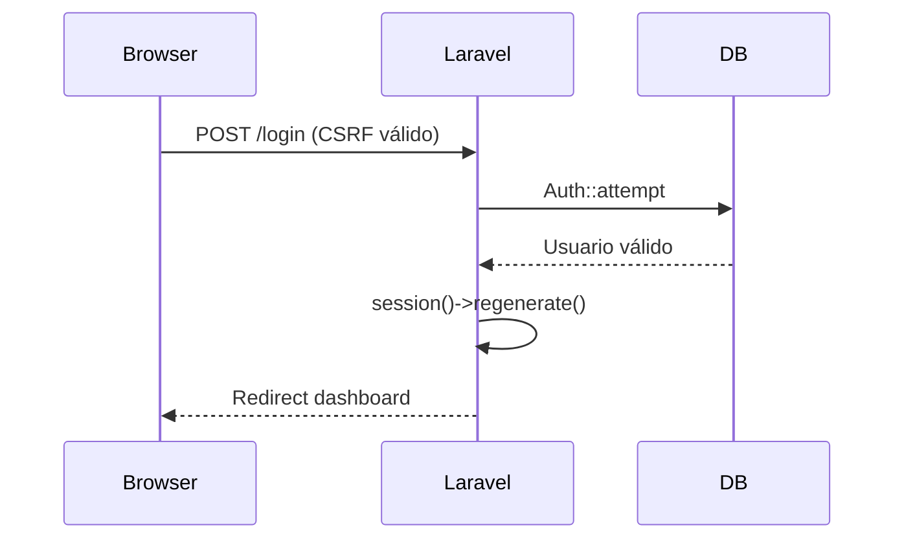
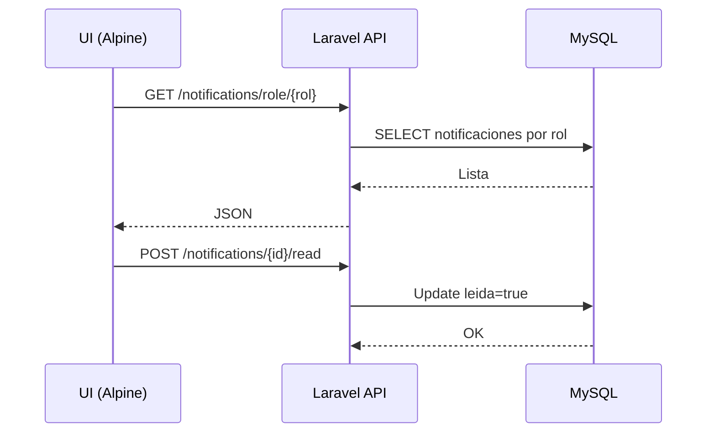
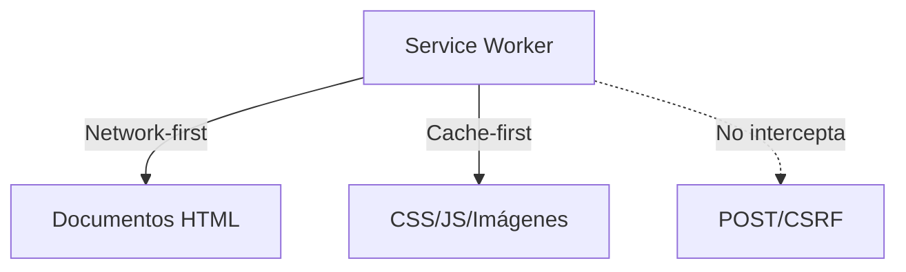

# Diagramas de Arquitectura — Sistema de Gestión de Estadías UTH

Este documento reúne los diagramas clave de la arquitectura seleccionada para el sistema (Laravel + Tailwind/Alpine + PWA + MySQL), alineados con los módulos por rol y el esquema de base de datos solicitado.

## 1. Arquitectura de Software (Alta Nivel)

```mermaid
flowchart LR
    subgraph Cliente[Cliente (Navegador)]
        UI[Tailwind + Alpine.js]
        SW[Service Worker]
    end

    subgraph Servidor[Servidor de Aplicación]
        RT[Routes (web.php)]
        MW[Middleware (CSRF, Auth, Role)]
        CT[Controllers (Auth, Estudiante, Profesor, Director, Biblioteca, Notification)]
        VWS[Views (Blade)]
    end

    subgraph Datos[Persistencia]
        DB[(MySQL)]
        CFG[configuracion_sistema]
        DOCS[documentos]
        EST[estadias]
        USR[users]
        ROL[roles]
        ESTU[estudiantes]
        PROF[profesores]
        EMP[empresas]
        SOLC[solicitud_carta_presentacions]
        NOTIF[notificaciones]
    end

    UI <--> SW
    UI -->|HTTP/HTTPS| RT
    RT --> MW --> CT --> VWS
    CT <--> DB
    DB --- USR & ROL & ESTU & PROF & EST & EMP & DOCS & SOLC & NOTIF & CFG
    SW <--> RT

    subgraph Build[Assets]
        Vite[Vite (desarrollo)/Build (producción)]
    end
    Vite --> UI
```

## 2. Vista Lógica por Rol



## 3. Diagrama de Despliegue (Conceptual)

```mermaid
flowchart LR
    Browser[Navegador] -- HTTP/HTTPS --> Web[Servidor Web (Laravel)]
    Web --> MySQL[(MySQL DB)]
    Browser <-- Assets --> CDN[Vite Build / Assets Estáticos]
    Browser <--> SW[Service Worker]
    Web <-- Logs/Config --> FS[(Sistema de Archivos)]
```

## 4. Modelo de Datos (ER Simplificado)



## 5. Secuencia — Solicitud de Carta (Rechazo y Re-solicitud)



## 6. Secuencia — Inicio de Sesión (CSRF y Sesión)



## 7. Secuencia — Notificaciones por Rol



## 8. PWA — Estrategias de Caché



---

Notas:
- Los diagramas están alineados con las migraciones y el esquema de datos actualizado (roles, users con `rol_id`, entidades de estadías y documentos, solicitudes de carta, notificaciones).
- Las rutas y controladores siguen Laravel con middleware de autenticación y control de rol.
- El PWA evita interferir con tokens CSRF y documentos dinámicos.

