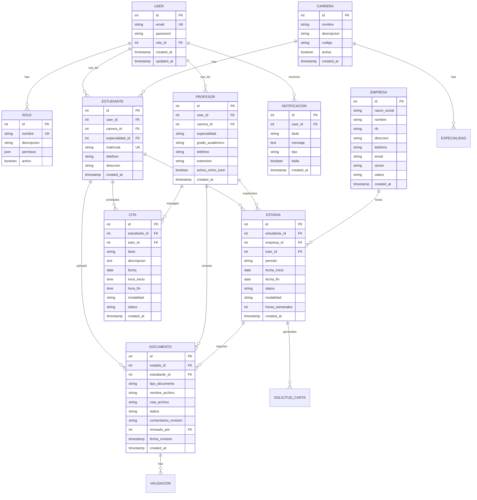

## 1. Architecture design


## 2. Technology Description

- **Frontend**: Laravel Blade + Tailwind CSS + Alpine.js
- **Backend**: Laravel 10.x Framework
- **Database**: MySQL 8.0
- **Authentication**: Laravel Sanctum + Session-based Auth
- **File Storage**: Laravel Storage (local/public)
- **PDF Generation**: DomPDF (barryvdh/laravel-dompdf)
- **Icons**: Font Awesome 6.x
- **JavaScript**: Alpine.js 3.x (lightweight reactivity)
- **CSS Framework**: Tailwind CSS 3.x

## 3. Route definitions

| Route | Purpose | Controller Method |
|-------|---------|-------------------|
| `/admin/dashboard` | Panel principal administrador | AuthController@redirectToDashboard |
| `/admin/usuarios` | Gestión completa de usuarios | AdministradorController@gestionarUsuarios |
| `/admin/configuracion` | Configuración del sistema | AdministradorController@configuracionSistema |
| `/admin/reportes-globales` | Reportes y estadísticas globales | AdministradorController@reportesGlobales |
| `/director/evaluaciones` | Panel de evaluaciones | DirectorController@evaluaciones |
| `/director/proyectos` | Gestión de proyectos | DirectorController@proyectosDisponibles |
| `/director/reportes-detallados` | Reportes avanzados | DirectorController@reportesDetallados |
| `/teacher/mensajeria` | Sistema de mensajería | ProfesorController@mensajeria |
| `/teacher/calendario` | Calendario integrado | ProfesorController@calendarioIntegrado |
| `/teacher/evaluaciones-avanzadas` | Evaluaciones con rúbricas | ProfesorController@evaluacionesAvanzadas |
| `/student/editor-proyectos` | Editor visual de proyectos | EstudianteController@editorProyectos |
| `/student/catalogo-empresas` | Catálogo interactivo de empresas | EstudianteController@catalogoEmpresas |
| `/student/seguimiento-visual` | Timeline visual de progreso | EstudianteController@seguimientoVisual |
| `/biblioteca/estadisticas-avanzadas` | Dashboard estadístico biblioteca | BibliotecaController@estadisticasAvanzadas |
| `/biblioteca/validacion-lote` | Validación masiva de memorias | BibliotecaController@validacionLote |
| `/biblioteca/reportes-bibliotecarios` | Reportes especializados | BibliotecaController@reportesBibliotecarios |

## 4. API definitions

### 4.1 User Management APIs

```
GET /api/admin/users
```
Request: Query parameters for filtering and pagination
Response: JSON array of users with roles and permissions

```
POST /api/admin/users
```
Request:
```json
{
  "name": "string",
  "email": "string @uth.edu.mx",
  "password": "string (min:8, special chars)",
  "role_id": "integer",
  "carrera_id": "integer (optional)",
  "activo": "boolean"
}
```

```
PUT /api/admin/users/{id}
```
Request: Same as POST, all fields optional

```
DELETE /api/admin/users/{id}
```
Response: `{ "success": true, "message": "Usuario eliminado" }`

### 4.2 System Configuration APIs

```
GET /api/admin/configuracion
```
Response: Current system configuration

```
POST /api/admin/configuracion
```
Request:
```json
{
  "plazos_documentos": {
    "propuesta": 30,
    "reporte_parcial": 60,
    "memoria": 90
  },
  "limites_archivo": {
    "max_size": "10MB",
    "tipos_permitidos": ["pdf", "doc", "docx"]
  },
  "notificaciones": {
    "habilitadas": true,
    "recordatorios": true
  }
}
```

### 4.3 Evaluation Management APIs

```
GET /api/director/evaluaciones/{id}
```
Response: Evaluation details with rubrics

```
POST /api/director/evaluaciones
```
Request:
```json
{
  "titulo": "string",
  "descripcion": "string",
  "rubricas": [
    {
      "criterio": "string",
      "peso": "integer (1-100)",
      "descripcion": "string"
    }
  ],
  "estudiantes_asignados": ["integer"]
}
```

### 4.4 Messaging System APIs

```
GET /api/teacher/mensajes
```
Response: Conversations list with unread counts

```
POST /api/teacher/mensajes
```
Request:
```json
{
  "destinatario_id": "integer",
  "asunto": "string",
  "mensaje": "string",
  "adjuntos": ["string (file paths)"]
}
```

### 4.5 Advanced Statistics APIs

```
GET /api/biblioteca/estadisticas
```
Response:
```json
{
  "memorias_procesadas": "integer",
  "tasa_aprobacion": "float (0-1)",
  "tiempo_promedio_validacion": "integer (hours)",
  "memorias_por_carrera": [
    {
      "carrera": "string",
      "total": "integer",
      "aprobados": "integer",
      "rechazados": "integer"
    }
  ]
}
```

## 5. Server architecture diagram


## 6. Data model

### 6.1 Data model definition



### 6.2 Data Definition Language

```sql
-- Tabla de usuarios mejorada
CREATE TABLE users (
    id BIGINT UNSIGNED AUTO_INCREMENT PRIMARY KEY,
    name VARCHAR(255) NOT NULL,
    email VARCHAR(255) UNIQUE NOT NULL,
    email_verified_at TIMESTAMP NULL,
    password VARCHAR(255) NOT NULL,
    rol_id BIGINT UNSIGNED NOT NULL,
    remember_token VARCHAR(100) NULL,
    activo BOOLEAN DEFAULT TRUE,
    ultimo_acceso TIMESTAMP NULL,
    configuracion_ui JSON NULL,
    created_at TIMESTAMP DEFAULT CURRENT_TIMESTAMP,
    updated_at TIMESTAMP DEFAULT CURRENT_TIMESTAMP ON UPDATE CURRENT_TIMESTAMP,
    FOREIGN KEY (rol_id) REFERENCES roles(id) ON DELETE RESTRICT
);

-- Índices para usuarios
CREATE INDEX idx_users_email ON users(email);
CREATE INDEX idx_users_rol_id ON users(rol_id);
CREATE INDEX idx_users_activo ON users(activo);

-- Tabla de configuración del sistema
CREATE TABLE configuracion_sistema (
    id BIGINT UNSIGNED AUTO_INCREMENT PRIMARY KEY,
    clave VARCHAR(100) UNIQUE NOT NULL,
    valor TEXT,
    tipo_dato VARCHAR(50) DEFAULT 'string',
    descripcion TEXT,
    categoria VARCHAR(100),
    editable BOOLEAN DEFAULT TRUE,
    created_at TIMESTAMP DEFAULT CURRENT_TIMESTAMP,
    updated_at TIMESTAMP DEFAULT CURRENT_TIMESTAMP ON UPDATE CURRENT_TIMESTAMP
);

-- Datos iniciales de configuración
INSERT INTO configuracion_sistema (clave, valor, tipo_dato, descripcion, categoria) VALUES
('plazo_propuesta_dias', '30', 'integer', 'Plazo máximo para entrega de propuesta de estadía', 'plazos'),
('plazo_reporte_parcial_dias', '60', 'integer', 'Plazo máximo para entrega de reporte parcial', 'plazos'),
('plazo_memoria_dias', '90', 'integer', 'Plazo máximo para entrega de memoria final', 'plazos'),
('max_tamano_archivo_mb', '10', 'integer', 'Tamaño máximo permitido para archivos', 'limites'),
('tipos_archivo_permitidos', 'pdf,doc,docx', 'string', 'Tipos de archivo permitidos', 'limites'),
('habilitar_notificaciones', 'true', 'boolean', 'Sistema de notificaciones habilitado', 'notificaciones'),
('habilitar_recordatorios', 'true', 'boolean', 'Recordatorios automáticos habilitados', 'notificaciones');

-- Tabla de mensajería
CREATE TABLE mensajes (
    id BIGINT UNSIGNED AUTO_INCREMENT PRIMARY KEY,
    remitente_id BIGINT UNSIGNED NOT NULL,
    destinatario_id BIGINT UNSIGNED NOT NULL,
    asunto VARCHAR(255),
    mensaje TEXT NOT NULL,
    leido BOOLEAN DEFAULT FALSE,
    fecha_lectura TIMESTAMP NULL,
    adjuntos JSON,
    created_at TIMESTAMP DEFAULT CURRENT_TIMESTAMP,
    FOREIGN KEY (remitente_id) REFERENCES users(id) ON DELETE CASCADE,
    FOREIGN KEY (destinatario_id) REFERENCES users(id) ON DELETE CASCADE
);

CREATE INDEX idx_mensajes_destinatario ON mensajes(destinatario_id);
CREATE INDEX idx_mensajes_leido ON mensajes(leido);

-- Tabla de eventos del calendario
CREATE TABLE eventos_calendario (
    id BIGINT UNSIGNED AUTO_INCREMENT PRIMARY KEY,
    titulo VARCHAR(255) NOT NULL,
    descripcion TEXT,
    fecha_inicio DATE NOT NULL,
    fecha_fin DATE,
    hora_inicio TIME,
    hora_fin TIME,
    todo_el_dia BOOLEAN DEFAULT FALSE,
    color VARCHAR(7) DEFAULT '#009d82',
    user_id BIGINT UNSIGNED NOT NULL,
    creado_por BIGINT UNSIGNED NOT NULL,
    created_at TIMESTAMP DEFAULT CURRENT_TIMESTAMP,
    updated_at TIMESTAMP DEFAULT CURRENT_TIMESTAMP ON UPDATE CURRENT_TIMESTAMP,
    FOREIGN KEY (user_id) REFERENCES users(id) ON DELETE CASCADE,
    FOREIGN KEY (creado_por) REFERENCES users(id) ON DELETE CASCADE
);

CREATE INDEX idx_eventos_user_id ON eventos_calendario(user_id);
CREATE INDEX idx_eventos_fecha_inicio ON eventos_calendario(fecha_inicio);

-- Tabla de rúbricas de evaluación
CREATE TABLE rubricas (
    id BIGINT UNSIGNED AUTO_INCREMENT PRIMARY KEY,
    nombre VARCHAR(255) NOT NULL,
    descripcion TEXT,
    tipo_evaluacion VARCHAR(100) NOT NULL,
    criterios JSON NOT NULL,
    total_puntos DECIMAL(5,2) DEFAULT 100.00,
    activa BOOLEAN DEFAULT TRUE,
    created_by BIGINT UNSIGNED NOT NULL,
    created_at TIMESTAMP DEFAULT CURRENT_TIMESTAMP,
    updated_at TIMESTAMP DEFAULT CURRENT_TIMESTAMP ON UPDATE CURRENT_TIMESTAMP,
    FOREIGN KEY (created_by) REFERENCES users(id) ON DELETE RESTRICT
);

CREATE INDEX idx_rubricas_tipo ON rubricas(tipo_evaluacion);
CREATE INDEX idx_rubricas_activa ON rubricas(activa);

-- Tabla de evaluaciones con rúbricas
CREATE TABLE evaluaciones_rubricas (
    id BIGINT UNSIGNED AUTO_INCREMENT PRIMARY KEY,
    estudiante_id BIGINT UNSIGNED NOT NULL,
    rubrica_id BIGINT UNSIGNED NOT NULL,
    evaluador_id BIGINT UNSIGNED NOT NULL,
    calificaciones JSON NOT NULL,
    puntuacion_total DECIMAL(5,2),
    comentarios TEXT,
    fecha_evaluacion DATE NOT NULL,
    status VARCHAR(50) DEFAULT 'pendiente',
    created_at TIMESTAMP DEFAULT CURRENT_TIMESTAMP,
    updated_at TIMESTAMP DEFAULT CURRENT_TIMESTAMP ON UPDATE CURRENT_TIMESTAMP,
    FOREIGN KEY (estudiante_id) REFERENCES estudiantes(id) ON DELETE CASCADE,
    FOREIGN KEY (rubrica_id) REFERENCES rubricas(id) ON DELETE RESTRICT,
    FOREIGN KEY (evaluador_id) REFERENCES users(id) ON DELETE RESTRICT
);

CREATE INDEX idx_evaluaciones_estudiante ON evaluaciones_rubricas(estudiante_id);
CREATE INDEX idx_evaluaciones_status ON evaluaciones_rubricas(status);
```