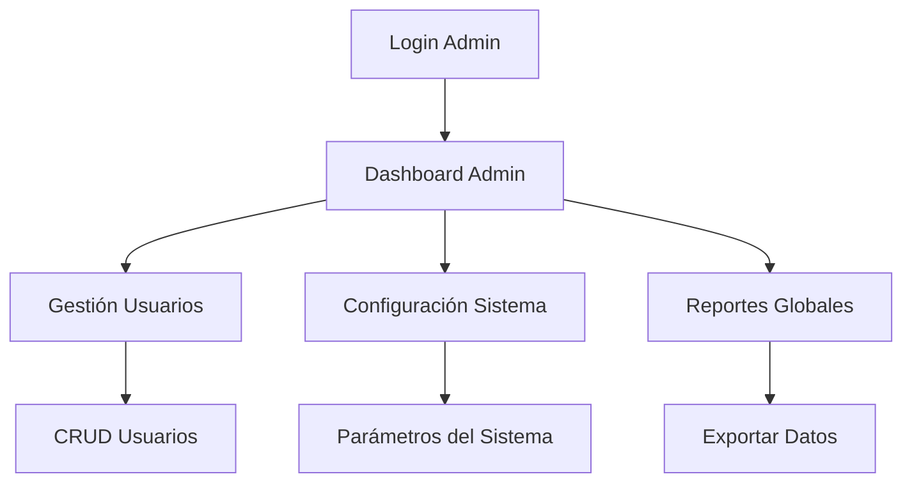
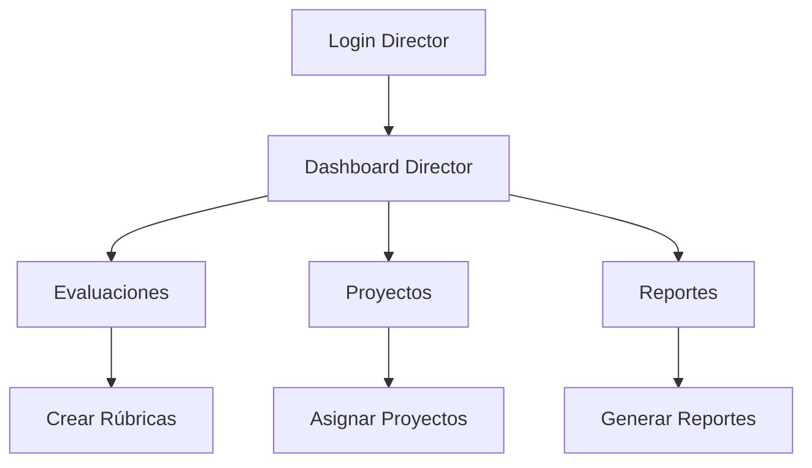
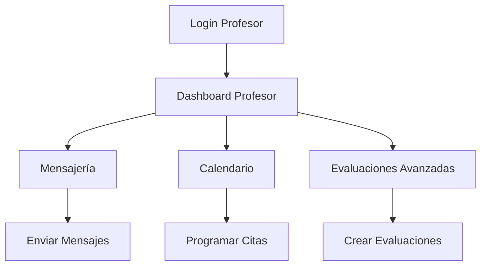
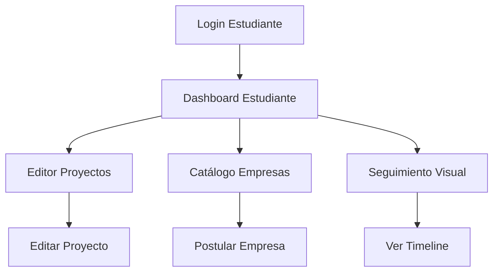
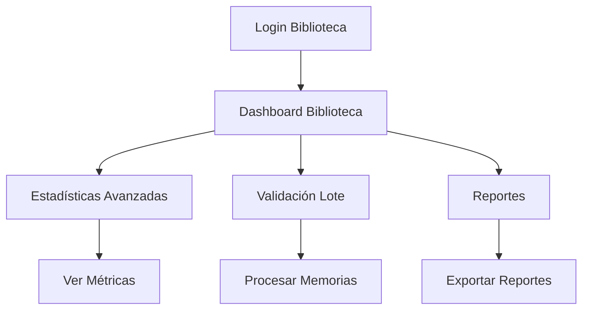

## 1. Product Overview
Sistema de gestión de estadías universitarias con interfaces gráficas completas para todos los roles. El sistema actual carece de interfaces visuales para varias funcionalidades críticas que se ejecutan solo en backend, lo que dificulta la interacción completa de los usuarios con el sistema.

## 2. Core Features

### 2.1 User Roles
| Role | Registration Method | Core Permissions |
|------|---------------------|------------------|
| Administrador | Sistema interno | Acceso completo a todo el sistema |
| Director | Asignación administrativa | Gestión académica y aprobaciones |
| Profesor | Asignación administrativa | Seguimiento de estudiantes y evaluaciones |
| Estudiante | Registro académico | Gestión de estadía y documentos |
| Biblioteca | Asignación administrativa | Validación de memorias de estadía |

### 2.2 Feature Module
Interfaces faltantes por desarrollar:

1. **Administrador**: Gestión completa de usuarios, configuración del sistema, reportes globales
2. **Director**: Interfaces de evaluación, gestión de proyectos, reportes detallados
3. **Profesor**: Sistema de mensajería completo, calendario integrado, evaluaciones avanzadas
4. **Estudiante**: Editor de proyectos completo, gestión de empresas, seguimiento visual
5. **Biblioteca**: Panel de estadísticas avanzado, validación en lote, reportes bibliotecarios

### 2.3 Page Details
| Page Name | Module Name | Feature description |
|-----------|-------------|---------------------|
| Admin Gestión Usuarios | CRUD Usuarios | Crear, editar, eliminar y visualizar todos los usuarios del sistema con búsqueda avanzada |
| Admin Configuración Sistema | Parámetros Globales | Configurar plazos, límites de documentos, plantillas de correo, roles y permisos |
| Admin Reportes Globales | Dashboard Analytics | Visualizar estadísticas globales, exportar datos, generar reportes institucionales |
| Director Evaluaciones | Panel Evaluativo | Crear rúbricas de evaluación, asignar evaluadores, revisar resultados |
| Director Proyectos | Gestión Proyectos | Administrar proyectos disponibles, asignar estudiantes, seguir progreso |
| Director Reportes Detallados | Analytics Avanzado | Generar reportes por carrera, período, empresa con gráficos interactivos |
| Profesor Mensajería | Sistema Mensajes | Enviar/recibir mensajes, crear grupos, adjuntar documentos, notificaciones |
| Profesor Calendario Integrado | Agenda Completa | Vista mensual/semanal de citas, arrastrar y soltar, recordatorios automáticos |
| Profesor Evaluaciones Avanzadas | Rúbricas Dinámicas | Crear evaluaciones personalizadas, cálculo automático de calificaciones |
| Estudiante Editor Proyectos | Editor Visual | Editor WYSIWYG para proyectos, vista previa, validación en tiempo real |
| Estudiante Gestión Empresas | Catálogo Interactivo | Filtrar empresas por carrera, ubicación, vacantes, postularse online |
| Estudiante Seguimiento Visual | Timeline Progreso | Visualización tipo timeline del progreso de estadía con hitos y documentos |
| Biblioteca Estadísticas Avanzadas | Dashboard Biblioteca | Métricas de validación, tiempos promedio, tasa de rechazo por carrera |
| Biblioteca Validación Lote | Proceso Masivo | Validar/rechazar múltiples memorias simultáneamente con comentarios masivos |
| Biblioteca Reportes Bibliotecarios | Reportes Especializados | Generar reportes de memorias por carrera, período, estado de validación |

## 3. Core Process

### Flujo Administrador

### Flujo Director

### Flujo Profesor

### Flujo Estudiante

### Flujo Biblioteca

## 4. User Interface Design

### 4.1 Design Style
- **Colores Primarios**: Verde UTH (#009d82, #00b894, #007a63)
- **Colores Secundarios**: Grises neutros (#f8fafc, #e2e8f0, #64748b)
- **Estilo de Botones**: Redondeados con sombras sutiles, hover effects
- **Tipografía**: Inter (Google Fonts), tamaños 14-16px para contenido, 18-24px para títulos
- **Estilo de Layout**: Card-based con bordes redondeados y sombras
- **Iconos**: Font Awesome 6, estilo outline consistente
- **Animaciones**: Transiciones suaves de 200-300ms

### 4.2 Page Design Overview
| Page Name | Module Name | UI Elements |
|-----------|-------------|-------------|
| Admin Dashboard | Stats Cards | Cards con iconos, gradientes de verde UTH, tipografía Inter bold |
| Gestión Usuarios | Data Table | Tabla con búsqueda, filtros, paginación, botones de acción con iconos |
| Configuración | Form Settings | Forms con inputs redondeados, switches toggles, color pickers |
| Director Evaluaciones | Rúbricas Panel | Drag & drop para criterios, vista previa de evaluación, barra de progreso |
| Profesor Calendario | Calendar View | Vista mensual/semanal, eventos color-coded, modal para nuevas citas |
| Estudiante Editor | WYSIWYG Editor | Toolbar con opciones de formato, vista previa en tiempo real, validación |
| Biblioteca Validación | Batch Processing | Checkboxes masivos, barra de progreso bulk, comentarios masivos |

### 4.3 Responsiveness
- **Diseño**: Desktop-first con adaptación mobile
- **Breakpoints**: 640px (sm), 768px (md), 1024px (lg), 1280px (xl)
- **Mobile**: Menú hamburguesa, cards apilados verticalmente, tablas scrollables horizontalmente
- **Touch**: Botones mínimo 44x44px, espaciado aumentado para interacción táctil
- **Accesibilidad**: WCAG 2.1 AA compliance, alto contraste, navegación por teclado, screen reader support